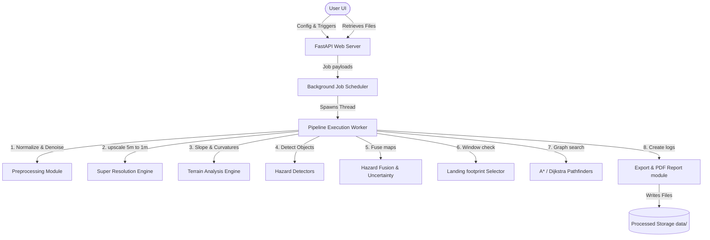

# System Architecture Manual

This document details the software architecture of the **LunarSafe AI** platform.

---

## 1. High-Level Component Interactions

---

## 2. Backend Design

* **API routing (`backend/app/main.py`):** Configures FastAPI routes, mounts static directories (`/api/results` and `/api/demo_data`), and runs the dynamic route replanners.
* **Background Scheduler (`backend/app/services/jobs.py`):** Heavy ML/upscaling calculations run in a thread-safe registry mapping. This prevents uvicorn event-loop blocks.
* **Processing Modules:** Standard OpenCV/NumPy filters. Supports dual-mode (Geospatial and standard fallback modes).

---

## 3. Frontend Architecture

Built on React + Vite:
* `DashboardOverview.tsx`: Renders overview statistics cards, comparative timelines, and explainable justifications.
* `InteractiveMap2D.tsx`: High-performance HTML5 Canvas-based 2D layer viewer. Synchronizes mouse zoom/pan transforms.
* `TerrainViewer3D.tsx`: Interactive Three.js WebGL heightfield renderer. Samples DEM heights, paints hazard textures, and animates descending trajectories. Includes dynamic obstacles path-invalidation bindings.
